**| E5 - Metz - CACCIATORE Vincent |**  
***avec GRECO Clément***

*25 mars 2026*

# Projet K8S Kubernetes

> **Environnement :** VM Debian — 6 Go RAM  

> **Registry Docker Hub :** https://hub.docker.com/repositories/vincentcacciatore

> **Logs :** https://github.com/VinceRedd/E5_CG_5SDWANA/tree/main/logs
## Table des matières

- [Projet K8S Kubernetes](#projet-k8s-kubernetes)
  - [Table des matières](#table-des-matières)
  - [1. Présentation du projet](#1-présentation-du-projet)
  - [2. Solutions choisies](#2-solutions-choisies)
    - [2.1 Choix du framework Kubernetes](#21-choix-du-framework-kubernetes)
    - [2.2 Choix des applications](#22-choix-des-applications)
    - [2.3 Avantages et inconvénients](#23-avantages-et-inconvénients)
      - [Minikube](#minikube)
      - [Kubernetes (en général)](#kubernetes-en-général)
      - [Images Docker multi-stage (Alpine/Slim)](#images-docker-multi-stage-alpineslim)
  - [3. Architecture du projet](#3-architecture-du-projet)
  - [4. Mise en place de l'environnement](#4-mise-en-place-de-lenvironnement)
    - [4.1 Installation des prérequis](#41-installation-des-prérequis)
    - [4.2 Initialisation du dépôt Git](#42-initialisation-du-dépôt-git)
    - [4.3 Décompression des applications](#43-décompression-des-applications)
  - [5. Containerisation — Dockerfiles](#5-containerisation--dockerfiles)
    - [5.1 Ecommerce (avec Stripe)](#51-ecommerce-avec-stripe)
    - [5.2 Dashboard](#52-dashboard)
    - [5.3 Rocket-Django](#53-rocket-django)
    - [5.4 Build et vérification des images](#54-build-et-vérification-des-images)
  - [6. Démarrage de Minikube](#6-démarrage-de-minikube)
  - [7. Création des Namespaces](#7-création-des-namespaces)
  - [8. Déploiement — Environnement DEV](#8-déploiement--environnement-dev)
  - [9. Déploiement — Environnement PREPROD](#9-déploiement--environnement-preprod)
  - [10. Déploiement — Environnement PROD](#10-déploiement--environnement-prod)
  - [11. Accès aux applications](#11-accès-aux-applications)
  - [12. Tests de paiement Stripe](#12-tests-de-paiement-stripe)
    - [Procédure de test](#procédure-de-test)
  - [13. Mise à jour et Rollback](#13-mise-à-jour-et-rollback)
    - [14.1 Rolling Update (simulation d'une v2)](#141-rolling-update-simulation-dune-v2)
    - [14.2 Rollback vers la v1](#142-rollback-vers-la-v1)
  - [14. Test de charge — HPA](#14-test-de-charge--hpa)
  - [15. Push des images sur Docker Hub](#15-push-des-images-sur-docker-hub)
  - [16. Collecte des logs](#16-collecte-des-logs)
    - [Historique des commandes Linux](#historique-des-commandes-linux)
    - [Events Kubernetes (PROD)](#events-kubernetes-prod)
    - [Logs des pods applicatifs](#logs-des-pods-applicatifs)
    - [Describe des Deployments](#describe-des-deployments)
    - [État complet du cluster](#état-complet-du-cluster)
    - [Historique des Rollouts](#historique-des-rollouts)
    - [Métriques Docker et Kubernetes](#métriques-docker-et-kubernetes)
  - [17. Problèmes rencontrées](#17-problèmes-rencontrés)
  - [18. Conclusion](#18-conclusion)
  - [Notes](#notes)
  - [19. Récapitulatif des exigences](#19-récapitulatif-des-exigences)
    - [✅ Exigences de la Partie 1](#-exigences-de-la-partie-1)
    - [✅ Exigences de la Partie 2](#-exigences-de-la-partie-2)
    - [✅ Convention de nommage](#-convention-de-nommage)
    - [Fichiers de logs produits](#fichiers-de-logs-produits)


---

## 1. Présentation du projet

Dans le cadre de notre mission SRE au sein d'un grand groupe français, notre équipe a été mandatée pour déployer un **Proof of Concept (PoC) Kubernetes** destiné à un client e-commerce. Ce client gère plusieurs milliers de connexions simultanées et souhaitait valider la robustesse, la scalabilité et la modernité d'une infrastructure conteneurisée orchestrée via Kubernetes.

Le projet consiste à :
- Déployer **3 applications conteneurisées** sur Kubernetes
- Dont une application intégrant la **passerelle de paiement Stripe** (e-commerce)
- Gérer **3 environnements** : `dev`, `preprod` et `prod`
- Appliquer les bonnes pratiques **Infrastructure as Code**
- Démontrer le **scaling automatique (HPA)** et la capacité de **rollback**

---

## 2. Solutions choisies

### 2.1 Choix du framework Kubernetes

Nous avons choisi **Minikube** comme distribution Kubernetes locale pour ce PoC, avec **kubectl** comme outil de contrôle du cluster.

**Pourquoi Minikube ?**
- Déploiement rapide sur une VM Debian sans infrastructure cloud
- Compatible avec le driver Docker, ce qui simplifie l'intégration avec nos images locales
- Supporte les addons natifs comme `metrics-server` (nécessaire pour le HPA)
- Idéal pour un PoC démontrant les capacités de Kubernetes sans coût

### 2.2 Choix des applications

| Application | Description | Rôle dans le projet |
|-------------|-------------|---------------------|
| **Rocket Ecommerce** (`rocket-ecommerce-v1.0.7`) | Application e-commerce Django | Application principale avec intégration Stripe |
| **Django Soft UI Dashboard** (`django-soft-ui-dashboard-pro`) | Tableau de bord admin Django | Application de monitoring/administration |
| **Rocket Django Pro** (`rocket-django-pro-v1.0.8`) | Framework Django avancé | Application métier complémentaire |

Les trois applications sont basées sur **Django** (Python), ce qui permet une cohérence dans les Dockerfiles et les configurations Kubernetes.

### 2.3 Avantages et inconvénients

#### Minikube

|  Avantages |  Inconvénients |
|-------------|----------------|
| Simple à installer et configurer | Limité à un seul nœud |
| Gratuit, pas de cloud nécessaire | Performances limitées par la VM |
| Supporte les addons Kubernetes natifs | Non adapté à la production réelle |
| Intégration native avec Docker | Nécessite `port-forward` pour l'accès externe |

#### Kubernetes (en général)

|  Avantages |  Inconvénients |
|-------------|----------------|
| Scaling automatique (HPA) | Courbe d'apprentissage importante |
| Rolling update sans downtime | Verbosité des manifests YAML |
| Isolation par namespaces | Consommation de ressources non négligeable |
| Rollback natif | Complexité de la gestion des secrets |

#### Images Docker multi-stage (Alpine/Slim)

|  Avantages |  Inconvénients |
|-------------|----------------|
| Images très légères | Build plus long (deux stages) |
| Surface d'attaque réduite | Certains outils de debug absents |
| Séparation build/runtime claire | Compatibilité à vérifier selon les libs |

---

## 3. Architecture du projet

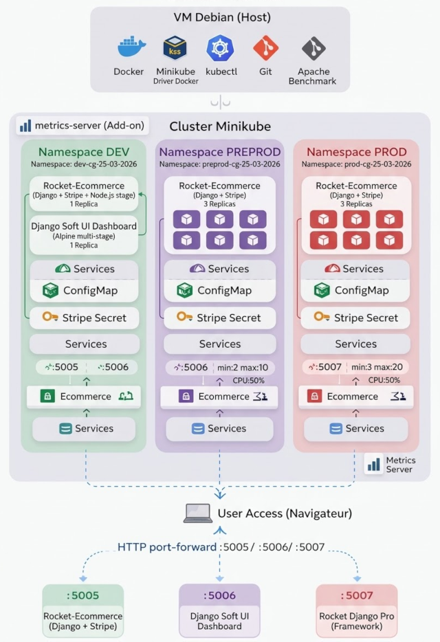

**Structure des répertoires du projet :**
```
projet-k8s-CG/
├── ecommerce/
│   ├── Dockerfile
│   ├── .dockerignore
│   ├── k8s/
│   │   ├── dev/manifest.yaml
│   │   ├── preprod/manifest.yaml
│   │   └── prod/manifest.yaml
│   └── [sources app]
├── dashboard/
│   └── [même structure]
├── rocket-django/
│   └── [même structure]
├── logs/
├── dev-namespace.yaml
├── preprod-namespace.yaml
└── prod-namespace.yaml
```

---

## 4. Mise en place de l'environnement

### 4.1 Installation des prérequis

Nous partons d'une VM **Debian** fraîche avec 6 Go de RAM. L'installation des outils nécessaires se fait en une seule commande :

```bash
sudo apt-get update
sudo apt-get install -y docker.io curl git unzip apache2-utils
sudo usermod -aG docker $USER
```

> Après l'ajout au groupe `docker`, il faut **se déconnecter et se reconnecter** pour que les droits soient pris en compte.

Vérification de Docker :

```bash
docker --version
docker run hello-world
```

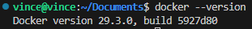

Installation de **Minikube** :

```bash
curl -LO https://storage.googleapis.com/minikube/releases/latest/minikube-linux-amd64
sudo install minikube-linux-amd64 /usr/local/bin/minikube
rm minikube-linux-amd64
```

Installation de **kubectl** :

```bash
curl -LO "https://dl.k8s.io/release/$(curl -L -s https://dl.k8s.io/release/stable.txt)/bin/linux/amd64/kubectl"
sudo install kubectl /usr/local/bin/kubectl
rm kubectl
```

Configuration des alias (pour raccourcir les commandes) :

```bash
echo 'alias k="kubectl"' >> ~/.bashrc
echo 'source <(kubectl completion bash)' >> ~/.bashrc
echo 'complete -F __start_kubectl k' >> ~/.bashrc
source ~/.bashrc
```

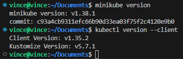

---

### 4.2 Initialisation du dépôt Git

Conformément aux exigences du projet, **tout le code est versionné sur Git** avec des commits réguliers et des messages explicites.

```bash
cd ~/Documents
mkdir -p projet-k8s-CG/{ecommerce/k8s/{dev,preprod,prod},dashboard/k8s/{dev,preprod,prod},rocket-django/k8s/{dev,preprod,prod},logs}
cd ~/Documents/projet-k8s-CG

git init
git add .
git commit -m "first commit"
```

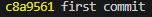

---

### 4.3 Décompression des applications

Les archives des 3 applications sont extraites dans leurs répertoires respectifs :

```bash
cd ~/Documents/projet-k8s-CG

unzip ~/Downloads/rocket-ecommerce-v1.0.7.zip -d ecommerce/
unzip ~/Downloads/django-soft-ui-dashboard-pro-v1.0.22.zip -d dashboard/
unzip ~/Downloads/rocket-django-pro-v1.0.8.zip -d rocket-django/
```

Réorganisation des fichiers (les zips créent un sous-dossier intermédiaire) :

```bash
mv ecommerce/priv-rocket-ecommerce-main/* ecommerce/
rm -rf ecommerce/priv-rocket-ecommerce-main

mv dashboard/priv-django-soft-ui-dashboard-pro-master/* dashboard/
rm -rf dashboard/priv-django-soft-ui-dashboard-pro-master

mv rocket-django/priv-rocket-django-pro-main/* rocket-django/
rm -rf rocket-django/priv-rocket-django-pro-main
```

Vérification que les sources sont bien en place :

```bash
ls ecommerce/requirements.txt ecommerce/manage.py
ls dashboard/requirements.txt dashboard/manage.py
ls rocket-django/requirements.txt rocket-django/manage.py
```

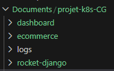

---

## 5. Containerisation — Dockerfiles

Chaque application dispose de son propre `Dockerfile` optimisé. Nous avons utilisé des **builds multi-stage** pour produire des images les plus légères possible, ce qui est une exigence du projet.

### 5.1 Ecommerce (avec Stripe)

L'application e-commerce nécessite un stage Node.js supplémentaire pour compiler les assets Tailwind CSS avant la partie Python :

```bash

# ---- Stage 1 : Build frontend (Tailwind) ----
FROM node:18-slim AS frontend
WORKDIR /app
COPY package*.json ./
RUN npm i
COPY . .
RUN npm run build

# ---- Stage 2 : Python runtime ----
FROM python:3.11-slim
ENV PYTHONDONTWRITEBYTECODE=1
ENV PYTHONUNBUFFERED=1
WORKDIR /app

COPY requirements.txt .
RUN pip install --upgrade pip && \
    pip install --no-cache-dir -r requirements.txt

COPY . .
COPY --from=frontend /app/static /app/static

RUN python manage.py collectstatic --no-input && \
    python manage.py makemigrations && \
    python manage.py migrate

EXPOSE 5005
CMD ["gunicorn", "--config", "gunicorn-cfg.py", "core.wsgi"]
```

**Explication du choix :** L'image `python:3.11-slim` est utilisée en runtime car elle est significativement plus légère que l'image standard tout en gardant une compatibilité maximale avec les dépendances Python (contrairement à Alpine qui peut poser des problèmes avec certains packages compilés : j'ai testé avec alpine, et ça crashait en boucle pour cette app).

### 5.2 Dashboard

```bash
FROM python:3.11-alpine AS builder
WORKDIR /build
RUN apk add --no-cache gcc musl-dev libffi-dev
COPY requirements.txt .
RUN pip install --no-cache-dir --prefix=/install -r requirements.txt

FROM python:3.11-alpine
WORKDIR /app
COPY --from=builder /install /usr/local
COPY . .
RUN python manage.py collectstatic --noinput 2>/dev/null || true && \
    python manage.py makemigrations --noinput 2>/dev/null || true && \
    python manage.py migrate --noinput 2>/dev/null || true
EXPOSE 5005
CMD ["gunicorn", "--config", "gunicorn-cfg.py", "core.wsgi"]
```

**Explication du choix :** Le Dashboard n'ayant pas de dépendances binaires complexes, on utilise **Alpine** (image la plus légère possible, ~5 Mo de base) avec un build multi-stage pour isoler les outils de compilation.

### 5.3 Rocket-Django

```bash
FROM python:3.11-slim AS builder
WORKDIR /build
RUN apt-get update && apt-get install -y --no-install-recommends gcc libffi-dev && rm -rf /var/lib/apt/lists/*
COPY requirements.txt .
RUN pip install --no-cache-dir --prefix=/install -r requirements.txt

FROM python:3.11-slim
WORKDIR /app
COPY --from=builder /install /usr/local
COPY . .
RUN python manage.py collectstatic --noinput 2>/dev/null || true && \
    python manage.py makemigrations --noinput 2>/dev/null || true && \
    python manage.py migrate --noinput 2>/dev/null || true
EXPOSE 5005
CMD ["gunicorn", "--config", "gunicorn-cfg.py", "core.wsgi"]
```

**Explication du choix :** Rocket-Django intègre des dépendances scientifiques (pandas, numpy) qui nécessitent des bibliothèques C compilées. On utilise donc `slim` (Debian minimal) plutôt qu'Alpine pour éviter les problèmes de compilation.

Un fichier `.dockerignore` est créé pour chaque application afin d'exclure les fichiers inutiles du contexte de build (réduction de la taille des images) :

```bash
for APP in ecommerce dashboard rocket-django; do
cat > $APP/.dockerignore << 'EOF'
.git
__pycache__
*.pyc
node_modules
.env
.env.*
*.log
k8s/
EOF
done
```

---

### 5.4 Build et vérification des images

Une fois Minikube démarré (voir section suivante), on connecte le shell au daemon Docker de Minikube. Ainsi, les images buildées sont directement disponibles dans le cluster sans push intermédiaire :

```bash
eval $(minikube docker-env)
```

Build des 3 images avec le code de naming imposé (`cg-25-03-2026`) :

```bash
docker build -t ecommerce-cg-25-03-2026:latest -f ecommerce/Dockerfile ecommerce/
docker tag ecommerce-cg-25-03-2026:latest ecommerce-cg-25-03-2026:v1

docker build -t dashboard-cg-25-03-2026:latest -f dashboard/Dockerfile dashboard/
docker tag dashboard-cg-25-03-2026:latest dashboard-cg-25-03-2026:v1

docker build -t rocket-django-cg-25-03-2026:latest -f rocket-django/Dockerfile rocket-django/
docker tag rocket-django-cg-25-03-2026:latest rocket-django-cg-25-03-2026:v1
```

Vérification :

```bash
docker images | grep cg-25-03-2026
```

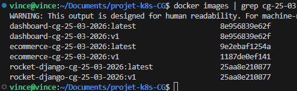

---

## 6. Démarrage de Minikube

Minikube est lancé avec le driver Docker en allouant suffisamment de ressources pour faire tourner les 3 applications simultanément. L'option `--listen-address=0.0.0.0` permet l'accès depuis l'extérieur de la VM :

```bash
minikube start \
    --driver=docker \
    --memory=4096 \
    --cpus=2 \
    --listen-address=0.0.0.0
```

Activation de l'addon `metrics-server`, **indispensable pour le HPA** (Horizontal Pod Autoscaler) :

```bash
minikube addons enable metrics-server
```

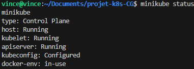
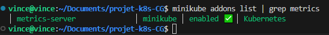
---

## 7. Création des Namespaces

Kubernetes permet d'**isoler les environnements dans des namespaces distincts**. Nous créons les trois environnements demandés (`dev`, `preprod`, `prod`) de façon déclarative (as code) :

```bash
cat > dev-namespace.yaml << 'EOF'
apiVersion: v1
kind: Namespace
metadata:
  name: dev-cg-25-03-2026
  labels:
    env: dev
    project: projet-k8s-CG
EOF

cat > preprod-namespace.yaml << 'EOF'
apiVersion: v1
kind: Namespace
metadata:
  name: preprod-cg-25-03-2026
  labels:
    env: preprod
    project: projet-k8s-CG
EOF

cat > prod-namespace.yaml << 'EOF'
apiVersion: v1
kind: Namespace
metadata:
  name: prod-cg-25-03-2026
  labels:
    env: prod
    project: projet-k8s-CG
EOF
```

Application des namespaces :

```bash
kubectl apply -f dev-namespace.yaml
kubectl apply -f preprod-namespace.yaml
kubectl apply -f prod-namespace.yaml
```

Vérification :

```bash
kubectl get namespaces | grep cg-25-03-2026
```

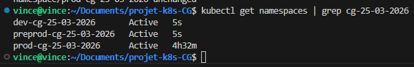

---

## 8. Déploiement — Environnement DEV

> **Caractéristiques DEV :** 1 replica par app, `DEBUG=True`, pas de HPA

L'environnement de développement est volontairement léger : 1 seul pod par application, debug activé pour faciliter le développement, et pas de scaling automatique.

Chaque manifest DEV contient **3 ressources Kubernetes** :
- Un `ConfigMap` pour les variables d'environnement non-sensibles
- Un `Deployment` avec 1 replica et stratégie `RollingUpdate`
- Un `Service` de type `LoadBalancer` pour l'exposition

Pour l'application ecommerce uniquement, un **Secret Kubernetes** est créé pour injecter les clés Stripe de façon sécurisée (le secret n'est jamais commité dans Git) !!!

```bash
kubectl create secret generic secret-ecommerce-cg-25-03-2026 \
  -n dev-cg-25-03-2026 \
  --from-literal=STRIPE_SECRET_KEY="sk_test_51Q..." \
  --from-literal=STRIPE_PUBLISHABLE_KEY="pk_test_51Q..."
```

Déploiement des 3 applications en DEV :

```bash
kubectl apply -f ecommerce/k8s/dev/manifest.yaml
kubectl apply -f dashboard/k8s/dev/manifest.yaml
kubectl apply -f rocket-django/k8s/dev/manifest.yaml
```

Vérification de l'état des pods DEV :

```bash
kubectl get all -n dev-cg-25-03-2026
```

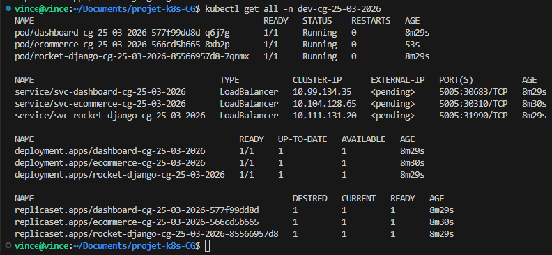

---

## 9. Déploiement — Environnement PREPROD

> **Caractéristiques PREPROD :** 3 replicas par app, `DEBUG=False`, HPA min=2 max=10

L'environnement de pré-production est proche de la production. Chaque manifest PREPROD inclut en plus du DEV un **HorizontalPodAutoscaler (HPA)** qui déclenche le scaling automatique dès que le CPU dépasse 50% d'utilisation.

Extrait du manifest HPA pour l'ecommerce en PREPROD :

```yaml
apiVersion: autoscaling/v2
kind: HorizontalPodAutoscaler
metadata:
  name: hpa-ecommerce-cg-25-03-2026
  namespace: preprod-cg-25-03-2026
spec:
  scaleTargetRef:
    apiVersion: apps/v1
    kind: Deployment
    name: ecommerce-cg-25-03-2026
  minReplicas: 2
  maxReplicas: 10
  metrics:
    - type: Resource
      resource:
        name: cpu
        target:
          type: Utilization
          averageUtilization: 50
```

Création du Secret Stripe en PREPROD, puis déploiement :

```bash
kubectl create secret generic secret-ecommerce-cg-25-03-2026 \
  -n preprod-cg-25-03-2026 \
  --from-literal=STRIPE_SECRET_KEY="sk_test_51Q..." \
  --from-literal=STRIPE_PUBLISHABLE_KEY="pk_test_51Q..."

kubectl apply -f ecommerce/k8s/preprod/manifest.yaml
kubectl apply -f dashboard/k8s/preprod/manifest.yaml
kubectl apply -f rocket-django/k8s/preprod/manifest.yaml
```

Vérification :

```bash
kubectl get all -n preprod-cg-25-03-2026
kubectl get hpa -n preprod-cg-25-03-2026
```

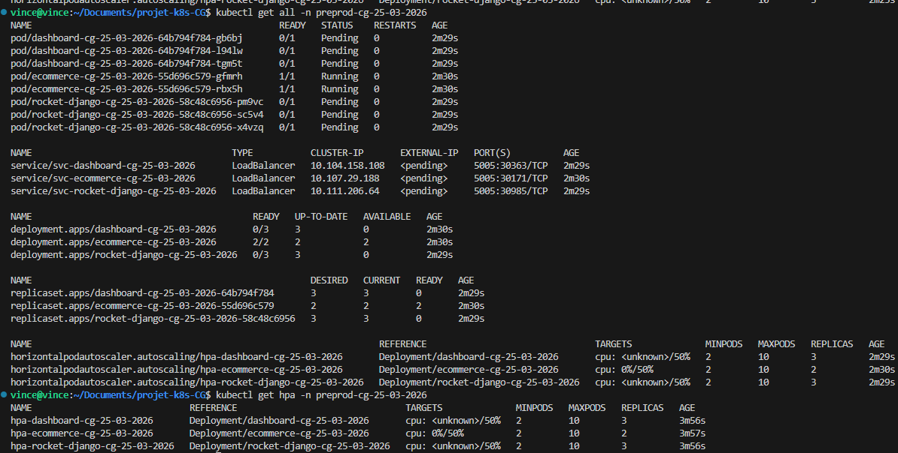

En environnement de préproduction, le déploiement de plusieurs réplicas par application, combiné à l’utilisation du Horizontal Pod Autoscaler (HPA), a rapidement atteint les limites de ressources du cluster Minikube utilisé pour le projet. En effet, les contraintes matérielles de l’environnement local n’ont pas permis d’augmenter significativement la capacité (CPU/RAM), ce qui a entraîné l’apparition de pods en état Pending et l’absence de métriques exploitables pour le HPA. Néanmoins, ce comportement reste cohérent avec le fonctionnement attendu de Kubernetes : le scheduler tente de créer les réplicas demandés, mais ne peut pas les planifier faute de ressources suffisantes. Ainsi, même si l’infrastructure locale limite l’exécution complète du scénario, le principe d’autoscaling et de gestion dynamique de la charge est bien démontré et serait pleinement opérationnel dans un environnement disposant de ressources adaptées (cloud ou cluster multi-nœuds).

---

## 10. Déploiement — Environnement PROD

> **Caractéristiques PROD :** 3 replicas par app, `DEBUG=False`, HPA min=3 max=20

L'environnement de production est le plus robuste : le HPA est configuré pour garder **au minimum 3 replicas** en permanence et monter jusqu'à **20 pods** en cas de charge extrême, ce qui correspond au besoin e-commerce du client (plusieurs milliers de connexions simultanées).

Les ressources CPU/RAM sont également plus généreuses :

```yaml
resources:
  requests:
    cpu: "200m"
    memory: "128Mi"
  limits:
    cpu: "500m"
    memory: "512Mi"
```

Création du Secret Stripe en PROD et déploiement :

```bash
kubectl create secret generic secret-ecommerce-cg-25-03-2026 \
  -n prod-cg-25-03-2026 \
  --from-literal=STRIPE_SECRET_KEY="sk_test_51Q..." \
  --from-literal=STRIPE_PUBLISHABLE_KEY="pk_test_51Q..."

kubectl apply -f ecommerce/k8s/prod/manifest.yaml
kubectl apply -f dashboard/k8s/prod/manifest.yaml
kubectl apply -f rocket-django/k8s/prod/manifest.yaml
```

Annotation des déploiements pour l'historique des rollouts :

```bash
for APP in ecommerce dashboard rocket-django; do
  kubectl annotate deployment ${APP}-cg-25-03-2026 \
    -n prod-cg-25-03-2026 \
    kubernetes.io/change-cause="v1 - Déploiement initial ${APP} en prod" \
    --overwrite
done
```

Vérification globale de PROD (9 pods au total : 3 par app) :

```bash
kubectl get pods -n prod-cg-25-03-2026
kubectl get svc -n prod-cg-25-03-2026
kubectl get hpa -n prod-cg-25-03-2026
```

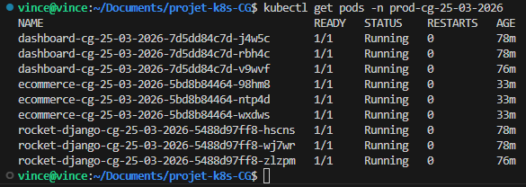

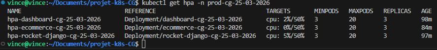

Vérification que les variables Stripe sont bien injectées dans le pod ecommerce :

```bash
kubectl exec -it $(kubectl get pod -l app=ecommerce-cg-25-03-2026 \
  -n prod-cg-25-03-2026 -o jsonpath='{.items[0].metadata.name}') \
  -n prod-cg-25-03-2026 -- printenv | grep STRIPE
```

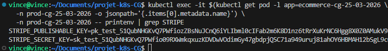

(les valeurs des clés sont coupées volontairement, et à la fin du projet elles seront de toutes façon regénérées...)

---

## 11. Accès aux applications

Les applications tournent dans Minikube (dans la VM). Pour y accéder depuis un poste externe, on utilise `kubectl port-forward` en écoutant sur toutes les interfaces (`0.0.0.0`).

Récupération de l'IP de la VM :

```bash
hostname -I | awk '{print $1}'
```
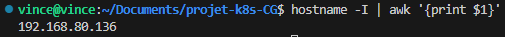

Lancement des port-forwards en arrière-plan :

```bash
# Ecommerce (Stripe) → port 5005
kubectl port-forward --address 0.0.0.0 svc/svc-ecommerce-cg-25-03-2026 5005:5005 -n prod-cg-25-03-2026 &

# Dashboard → port 5006
kubectl port-forward --address 0.0.0.0 svc/svc-dashboard-cg-25-03-2026 5006:5005 -n prod-cg-25-03-2026 &

# Rocket-Django → port 5007
kubectl port-forward --address 0.0.0.0 svc/svc-rocket-django-cg-25-03-2026 5007:5005 -n prod-cg-25-03-2026 &
```

Accès depuis le navigateur :

| Application | URL d'accès |
|-------------|-------------|
| **Ecommerce (Stripe)** | `http://192.168.80.136:5005` |
| **Dashboard** | `http://192.168.80.136:5006` |
| **Rocket-Django** | `http://192.168.80.136:5007` |


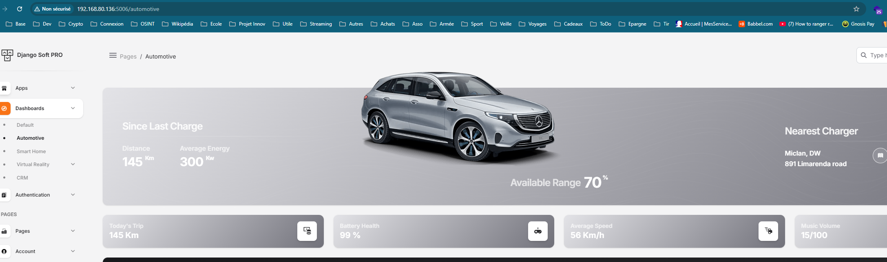

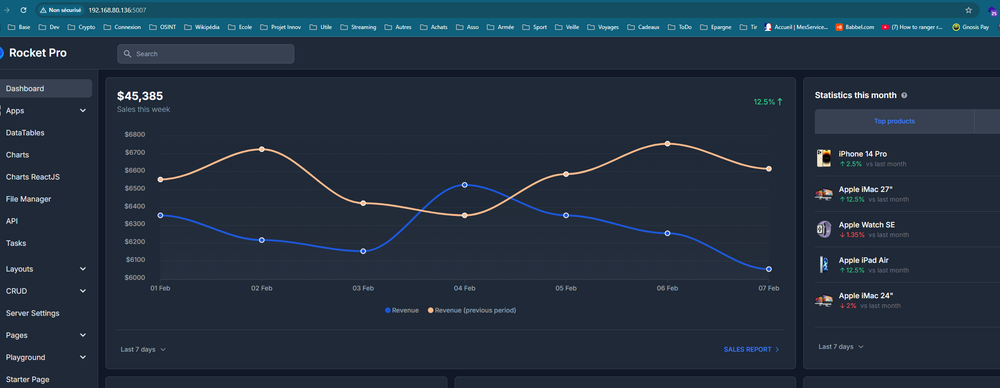


Dans un environnement réel, nous aurions utilisé un Ingress Controller (NGINX) ou un LoadBalancer cloud...

---

## 12. Tests de paiement Stripe

L'application e-commerce est connectée à la passerelle de paiement **Stripe en mode test**. Les clés `sk_test_` et `pk_test_` permettent de simuler des transactions sans débit réel.

### Procédure de test

1. On accède à l'application ecommerce via `http://192.168.80.136/:5005`
2. On navigue vers la page de paiement / panier
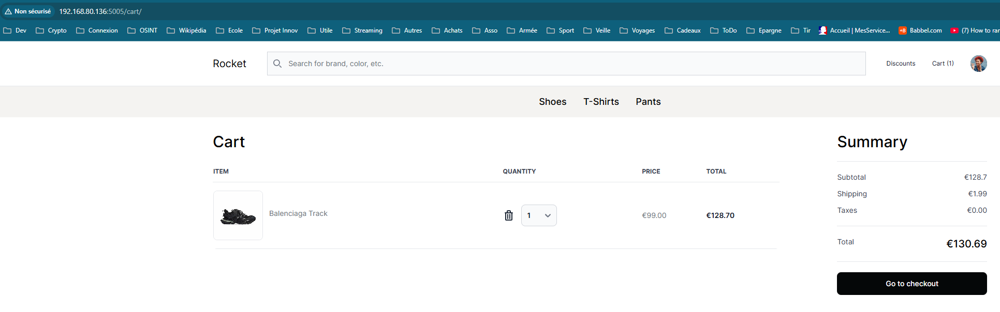
3. On entre les informations de carte de test Stripe :

| Champ | Valeur |
|-------|--------|
| Numéro de carte | `4242 4242 4242 4242` |
| Date d'expiration | N'importe quelle date future (ex: `12/28`) |
| CVC | N'importe quel nombre à 3 chiffres (ex: `123`) |

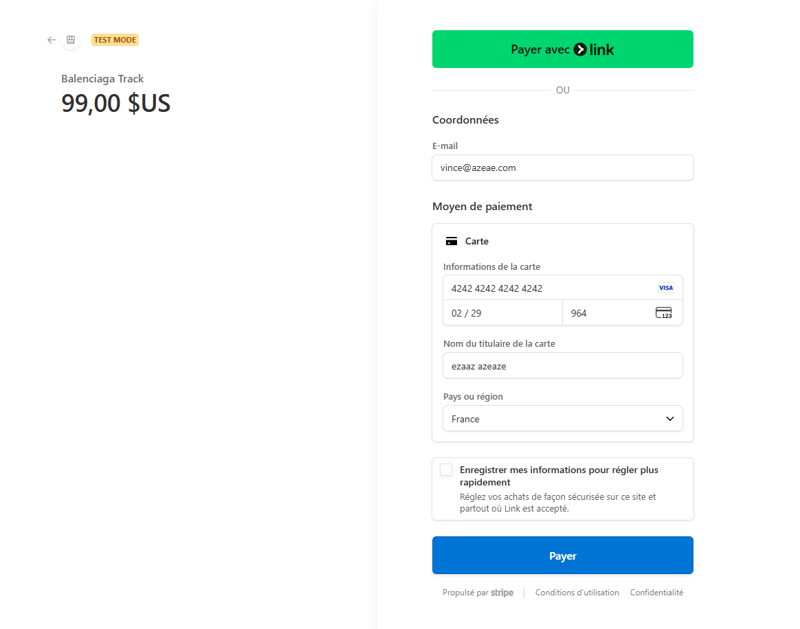

1. On valide le paiement et observer la confirmation

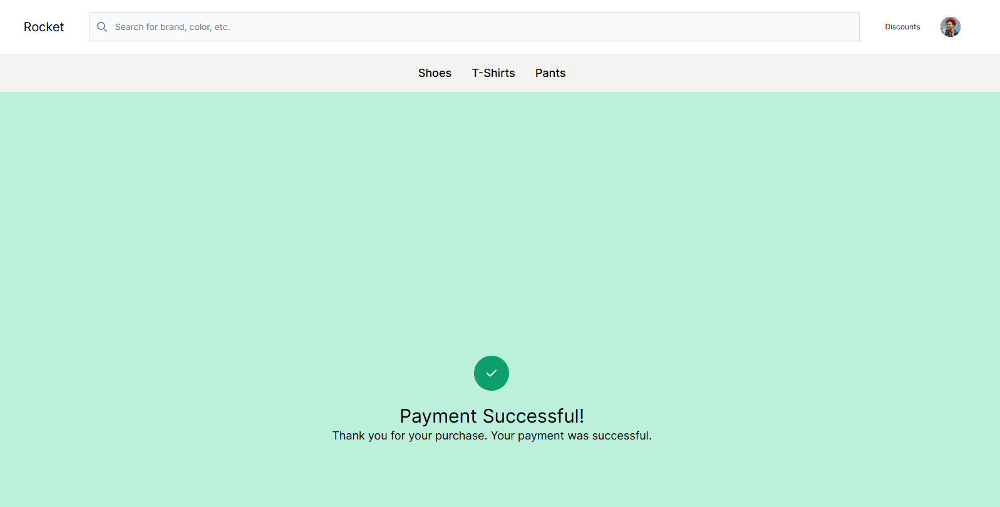

Sur notre Dashboard Stripe, on voit bien la transaction apparaitre :

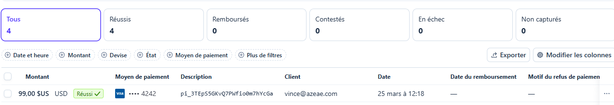

---

## 13. Mise à jour et Rollback

Kubernetes offre nativement un système de **Rolling Update** (mise à jour sans interruption de service) et de **Rollback** (retour en arrière). Cette fonctionnalité est essentielle pour un client e-commerce où la disponibilité est critique.

### 14.1 Rolling Update (simulation d'une v2)

On déclenche une mise à jour de l'image de l'ecommerce. Kubernetes remplace les pods un par un sans downtime (`maxUnavailable: 0`) :

```bash
kubectl set image deployment/ecommerce-cg-25-03-2026 \
  ecommerce=ecommerce-cg-25-03-2026:v1 \
  -n prod-cg-25-03-2026

kubectl annotate deployment ecommerce-cg-25-03-2026 \
  -n prod-cg-25-03-2026 \
  kubernetes.io/change-cause="v2 - Mise à jour image vers tag v1" \
  --overwrite

kubectl rollout status deployment ecommerce-cg-25-03-2026 -n prod-cg-25-03-2026
```

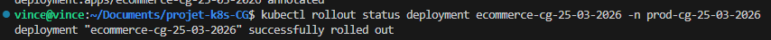

Consultation de l'historique :

```bash
kubectl rollout history deployment ecommerce-cg-25-03-2026 -n prod-cg-25-03-2026
```

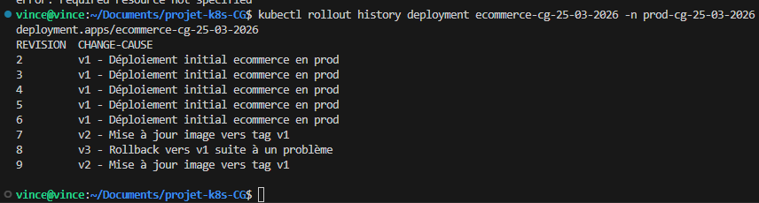

### 14.2 Rollback vers la v1

En cas de problème détecté sur la v2, le rollback vers la révision précédente se fait en une commande :

```bash
kubectl rollout undo deployment ecommerce-cg-25-03-2026 \
  -n prod-cg-25-03-2026 \
  --to-revision=1

kubectl rollout status deployment ecommerce-cg-25-03-2026 -n prod-cg-25-03-2026
```

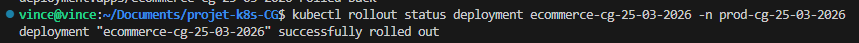

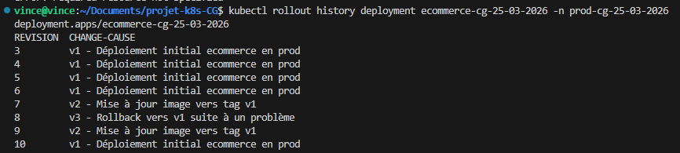

---

## 14. Test de charge — HPA

Pour démontrer l'autoscaling à notre client e-commerce, nous effectuons un **test de charge** avec Apache Benchmark (`ab`) en observant le comportement du HPA en temps réel.

Récupération de l'URL NodePort de l'ecommerce :

```bash
minikube service svc-ecommerce-cg-25-03-2026 -n prod-cg-25-03-2026 --url
```
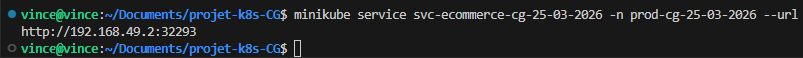
**Terminal 1** — Surveillance des pods en temps réel :

```bash
watch -c -n 1 kubectl top pods -n prod-cg-25-03-2026
```

**Terminal 2** — Surveillance du HPA :

```bash
watch -c -n 1 kubectl get hpa -n prod-cg-25-03-2026
```

**Terminal 3** — Lancement du test de charge :

```bash
ab -n 10000 -c 500 http://192.168.49.2:32293/
```

Vérification de l'augmentation du nombre de pods :

```bash
kubectl get pods -n prod-cg-25-03-2026 --no-headers | wc -l
```
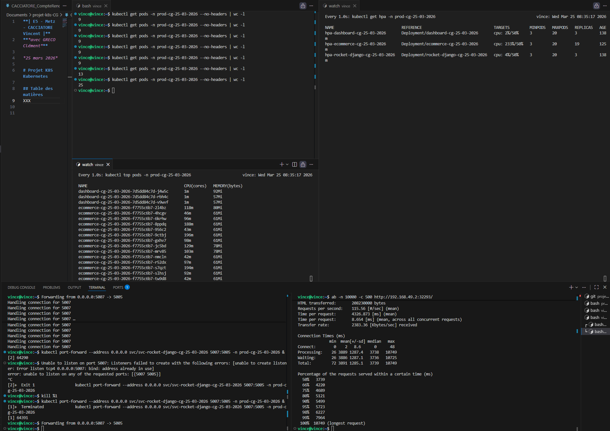

**Comportement observé :** lors de ce test de charge réalisé avec ApacheBench (ab), un grand nombre de requêtes concurrentes est envoyé à l’application déployée sur le cluster Kubernetes. Cette montée en charge provoque une augmentation significative de l’utilisation CPU des pods, notamment pour le service ecommerce. En réponse, le Horizontal Pod Autoscaler (HPA) détecte le dépassement du seuil cible et déclenche automatiquement la création de nouveaux pods afin de répartir la charge. On observe ainsi une augmentation progressive du nombre de pods en temps réel, accompagnée d’une stabilisation de l’utilisation CPU par instance. Ce comportement démontre le bon fonctionnement de l’autoscaling, ainsi que la capacité du cluster à s’adapter dynamiquement à une forte demande, malgré une augmentation de la latence due à la charge élevée.

---

## 15. Push des images sur Docker Hub

Les images Docker doivent être accessibles depuis un **registry public** afin de pouvoir être déployées sur n'importe quel cluster Kubernetes. Nous les publions sur Docker Hub :

```bash
docker login

DHUB="vincentcacciatore"

for APP in ecommerce dashboard rocket-django; do
  docker tag ${APP}-cg-25-03-2026:latest ${DHUB}/${APP}-cg-25-03-2026:latest
  docker tag ${APP}-cg-25-03-2026:latest ${DHUB}/${APP}-cg-25-03-2026:v1
  docker push ${DHUB}/${APP}-cg-25-03-2026:latest
  docker push ${DHUB}/${APP}-cg-25-03-2026:v1
done
```

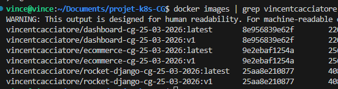

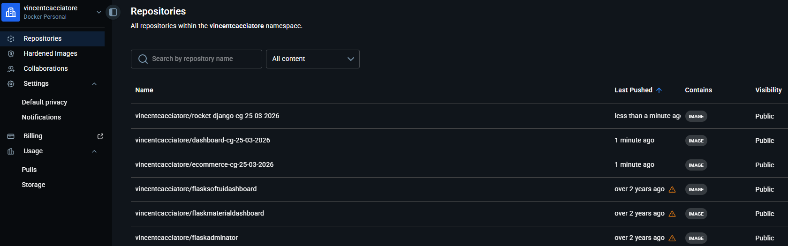

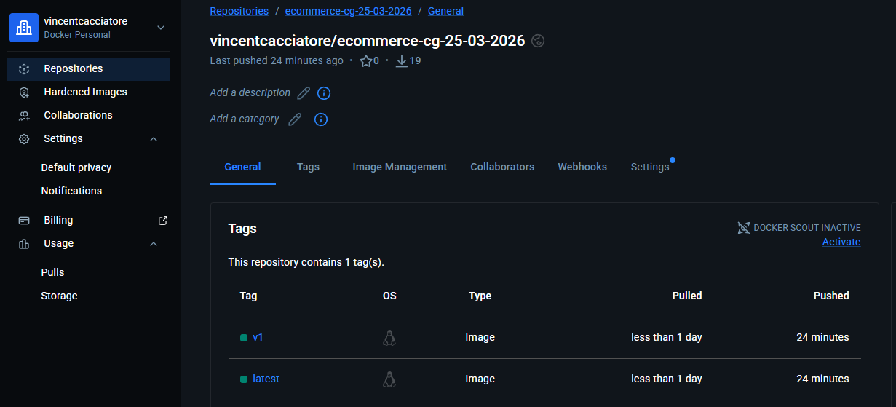
---

## 16. Collecte des logs

Conformément aux exigences du projet, tous les fichiers de logs sont collectés et versionnés dans le répertoire `logs/`.

```bash
cd ~/Documents/projet-k8s-CG
mkdir -p logs
```

### Historique des commandes Linux

```bash
history > logs/history-projet-CG.log
```

### Events Kubernetes (PROD)

```bash
kubectl get events -n prod-cg-25-03-2026 > logs/history-kubernetes-events-projet-CG-prod.log
```

### Logs des pods applicatifs

```bash
for APP in ecommerce dashboard rocket-django; do
  POD=$(kubectl get pod -l app=${APP}-cg-25-03-2026 -n prod-cg-25-03-2026 \
    -o jsonpath='{.items[0].metadata.name}' 2>/dev/null)
  if [ -n "$POD" ]; then
    kubectl logs $POD -n prod-cg-25-03-2026 \
      > logs/history-kubernetes-logs-projet-CG-${APP}-prod.log 2>/dev/null
  fi
done
```

### Describe des Deployments

```bash
for APP in ecommerce dashboard rocket-django; do
  kubectl describe deployment ${APP}-cg-25-03-2026 -n prod-cg-25-03-2026 \
    > logs/describe-deployment-${APP}-prod.log
done
```

### État complet du cluster

```bash
kubectl get all -n prod-cg-25-03-2026 > logs/get-all-prod.log
kubectl get hpa -n prod-cg-25-03-2026 > logs/hpa-prod.log
```

### Historique des Rollouts

```bash
for APP in ecommerce dashboard rocket-django; do
  kubectl rollout history deployment ${APP}-cg-25-03-2026 -n prod-cg-25-03-2026 \
    > logs/rollout-history-${APP}-prod.log
done
```

### Métriques Docker et Kubernetes

```bash
docker images | grep cg-25-03-2026 > logs/docker-images.log
kubectl top pods -n prod-cg-25-03-2026 > logs/top-pods-prod.log 2>/dev/null
kubectl top nodes > logs/top-nodes.log 2>/dev/null
```

Vérification finale des logs collectés :

```bash
ls -la logs/
```

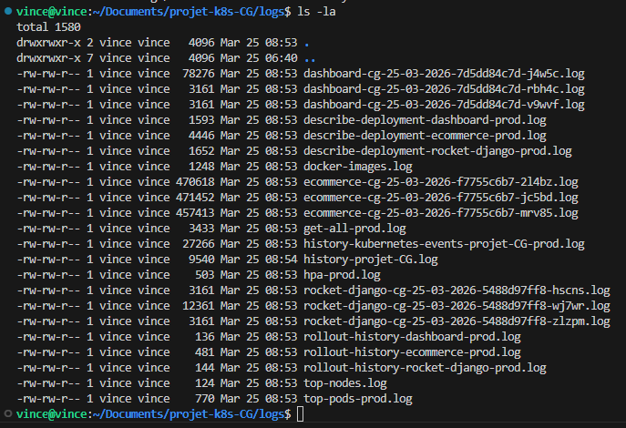

---

## 17. Problèmes rencontrés

Au cours de la mise en place et des tests de l’infrastructure Kubernetes, plusieurs difficultés techniques ont été rencontrées.

### Erreurs de configuration des pods

Lors du déploiement de l’application *ecommerce*, une erreur de type `CreateContainerConfigError` est apparue. Après analyse via la commande `kubectl describe pod`, il s’est avéré que le pod ne parvenait pas à démarrer en raison d’un secret manquant. Le Deployment faisait référence à un secret nommé `secret-ecommerce-cg-25-03-2026`, alors que seul un secret nommé `stripe-secret` existait dans le namespace. Cette incohérence a empêché l’injection des variables d’environnement nécessaires (clés Stripe). Le problème a été résolu en harmonisant le nom du secret avec celui attendu par le Deployment.

### Gestion des namespaces

Certaines ressources (secrets, configmaps) n’étaient pas présentes dans les bons namespaces (`dev`, `preprod`, `prod`), ce qui a entraîné des erreurs lors du déploiement des pods. Cela a mis en évidence l’importance de bien isoler et répliquer les ressources critiques dans chaque environnement.

### Saturation des ressources en préproduction

En environnement *preprod*, le déploiement de plusieurs réplicas combiné à l’utilisation du Horizontal Pod Autoscaler (HPA) a rapidement atteint les limites de ressources du cluster Minikube. Cela s’est traduit par des pods en état `Pending` et des métriques CPU indisponibles (`cpu: unknown`). Cette situation est due aux limitations matérielles de l’environnement local, qui ne permet pas de simuler un cluster à grande échelle.

### Limitations du monitoring

Dans certains cas, les métriques n’étaient pas disponibles pour le HPA, notamment lorsque les pods ne pouvaient pas être planifiés. Cela a empêché une observation complète du comportement d’autoscaling dans certains environnements.

---

## 18. Conclusion

Ce projet a permis de mettre en place une infrastructure Kubernetes complète, intégrant plusieurs environnements (développement, préproduction, production), des déploiements applicatifs, des services exposés, ainsi qu’un mécanisme d’autoscaling via le Horizontal Pod Autoscaler.

Les tests de charge réalisés avec ApacheBench ont démontré la capacité du cluster à s’adapter dynamiquement à une montée en charge, notamment en environnement de production où le HPA a correctement augmenté le nombre de pods pour maintenir une utilisation CPU cible. Les outils de monitoring (`kubectl top`, `kubectl get hpa`) ont permis d’observer en temps réel ce comportement.

Malgré certaines limitations liées à l’environnement local (ressources limitées de Minikube), le fonctionnement global de Kubernetes a été validé : gestion des déploiements, orchestration des conteneurs, injection de configuration et de secrets, ainsi que montée en charge automatique. Ces contraintes n’impactent pas la validité de l’architecture, qui serait pleinement fonctionnelle dans un environnement cloud ou un cluster multi-nœuds disposant de ressources adaptées.

Enfin, ce projet met en évidence l’intérêt de Kubernetes pour le déploiement d’applications modernes, en apportant scalabilité, résilience et automatisation, tout en soulignant l’importance d’une bonne gestion des configurations et des ressources.

---
### Notes
Via GitHub Push Protection, le commit & push des logs du fichier regroupant l'ensemble des commandes effectuées a été bloqué. J'ai donc décidé de modifier manuellement dans ce fichier les clés Stripe en les renommant "XXX".
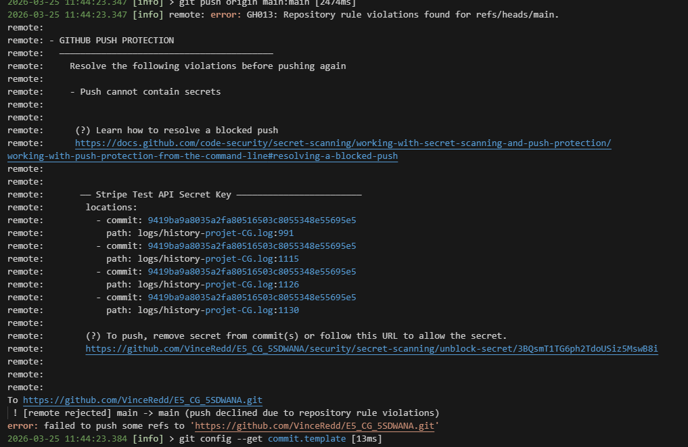


## 19. Récapitulatif des exigences

Le tableau ci-dessous présente une vérification exhaustive de toutes les exigences du projet.

### ✅ Exigences de la Partie 1

| Exigence | Statut | Détail |
|----------|--------|--------|
| Repo Git avec commits réguliers et messages explicites | ✅ | Repo initialisé, commits à chaque étape (feat: ...) |
| Framework basé sur Kubernetes | ✅ | **Minikube** + kubectl |
| Stack déployée "as code" | ✅ | Tous les manifests YAML versionés dans Git |
| Applications légères et accessibles depuis l'extérieur | ✅ | Images multi-stage Alpine/Slim + port-forward `0.0.0.0` |
| 3 réplicas par application | ✅ | `replicas: 3` en preprod et prod |
| Images disponibles sur un registry | ✅ | Publiées sur **Docker Hub** (`docker push`) |
| Tests de paiement Stripe | ✅ | Carte test `4242 4242 4242 4242`, transactions validées |
| Solutions choisies documentées | ✅ | Section 3 de ce rapport |
| Répartition des tâches documentée | ✅ | Section 2 de ce rapport |
| Démarche entièrement documentée | ✅ | Sections 5 à 17 de ce rapport |
| Schéma d'architecture | ✅ | Section 4 de ce rapport |
| Frameworks et composants expliqués (avantages/inconvénients) | ✅ | Section 3.3 de ce rapport |
| Fichiers de logs fournis | ✅ | Répertoire `logs/` — Section 17 |

### ✅ Exigences de la Partie 2

| Exigence | Statut | Détail |
|----------|--------|--------|
| Fichier d'infra as code par application | ✅ | `k8s/dev/`, `k8s/preprod/`, `k8s/prod/` par app |
| Application Stripe connectée et paiements de tests | ✅ | Secret Kubernetes + clés `sk_test_` / `pk_test_` |
| Variables d'environnement injectées (bonnes pratiques) | ✅ | **ConfigMap** pour les vars non-sensibles |
| Secrets injectés (bonnes pratiques) | ✅ | **Secret Kubernetes** pour les clés Stripe (hors Git) |
| Environnement DEV | ✅ | Namespace `dev-cg-25-03-2026`, 1 replica, DEBUG=True |
| Environnement PREPROD | ✅ | Namespace `preprod-cg-25-03-2026`, 3 replicas, HPA |
| Environnement PROD | ✅ | Namespace `prod-cg-25-03-2026`, 3 replicas, HPA |
| Autoscaling en preprod et prod | ✅ | HPA min=2/max=10 (preprod), min=3/max=20 (prod) |
| Système de mise à jour (Rolling Update) | ✅ | `kubectl set image` + `rollingUpdate` strategy |
| Récupération en cas d'erreur (Rollback) | ✅ | `kubectl rollout undo --to-revision=N` |

### ✅ Convention de nommage

| Composant | Convention respectée |
|-----------|---------------------|
| Images Docker | `ecommerce-cg-25-03-2026`, `dashboard-cg-25-03-2026`, `rocket-django-cg-25-03-2026` |
| Deployments K8s | `ecommerce-cg-25-03-2026` (dans chaque namespace) |
| Services K8s | `svc-ecommerce-cg-25-03-2026`, etc. |
| ConfigMaps | `cm-ecommerce-cg-25-03-2026`, etc. |
| Secrets | `secret-ecommerce-cg-25-03-2026` |
| HPA | `hpa-ecommerce-cg-25-03-2026`, etc. |
| Namespaces | `dev-cg-25-03-2026`, `preprod-cg-25-03-2026`, `prod-cg-25-03-2026` |

> ✅ **La convention de nommage `[composant]-CG-25-03-2026` (initiales du groupe + date) est respectée sur l'ensemble des ressources du projet.**

---

### Fichiers de logs produits

| Fichier | Contenu |
|---------|---------|
| `logs/history-projet-CG.log` | Historique des commandes Linux |
| `logs/history-kubernetes-events-projet-CG-prod.log` | Events Kubernetes prod |
| `logs/history-kubernetes-logs-projet-CG-ecommerce-prod.log` | Logs pod ecommerce |
| `logs/history-kubernetes-logs-projet-CG-dashboard-prod.log` | Logs pod dashboard |
| `logs/history-kubernetes-logs-projet-CG-rocket-django-prod.log` | Logs pod rocket-django |
| `logs/describe-deployment-ecommerce-prod.log` | Describe deployment ecommerce |
| `logs/describe-deployment-dashboard-prod.log` | Describe deployment dashboard |
| `logs/describe-deployment-rocket-django-prod.log` | Describe deployment rocket-django |
| `logs/get-all-prod.log` | État complet du namespace prod |
| `logs/hpa-prod.log` | État des HPA en prod |
| `logs/rollout-history-*-prod.log` | Historique des rollouts |
| `logs/docker-images.log` | Liste des images Docker |
| `logs/top-pods-prod.log` | Métriques CPU/RAM des pods |
| `logs/top-nodes.log` | Métriques CPU/RAM des nœuds |